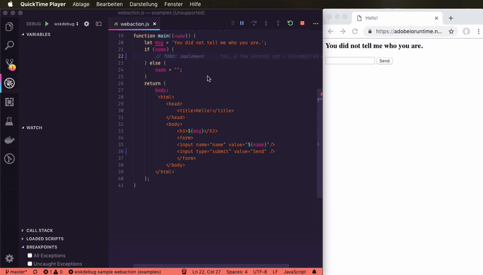
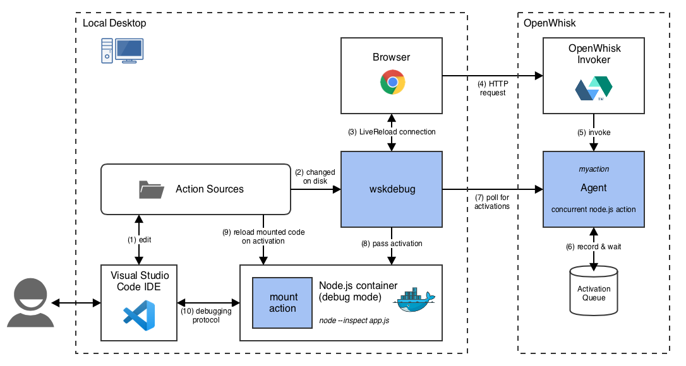

 [](https://www.npmjs.com/package/@adobe/wskdebug) [](http://www.apache.org/licenses/LICENSE-2.0)

wskdebug
========

Debugging and live development for [Apache OpenWhisk](https://openwhisk.apache.org). CLI tool written in [Node.js](https://nodejs.org) and depending on a [local Docker](https://www.docker.com/products/docker-desktop). Integrates easily into IDEs such as [Visual Studio Code](https://code.visualstudio.com).



_This screen cast shows live development of a web action using `wskdebug`. On the left [Visual Studio Code](https://code.visualstudio.com) in debug mode. On the right, a browser with the page rendered by the web action. The developer notices the feature of handling the `name` is not implemented yet. A breakpoint shows them that `name` is set, but it's not used. They add the code to respond and greet with `name`. Simply by saving the code, the browser auto reloads the page and the breakpoint is hit again. They step through to see that the new code is working fine, and get the expected result in the browser: "Hello, Alex!"._

### Contents

  * [Installation](#installation)
  * [About](#about)
  * [Usage](#usage)
  * [Troubleshooting](#troubleshooting)
  * [How it works](#how-it-works)
  * [Development](#development)
  * [Contributing](#contributing)
  * [Licensing](#licensing)

<a name="installation"></a>
## Installation

`wskdebug` requires [Node.js](https://nodejs.org) (version 10+), `npm` and a local [Docker](https://www.docker.com/products/docker-desktop) environment.

To install or update run:

```
npm install -g @adobe/wskdebug
```

<a name="uninstall"></a>
### Uninstall

```
npm uninstall -g @adobe/wskdebug
```

<a name="about"></a>
## About

_wskdebug_ is a command line tool to **develop and debug** [OpenWhisk actions](https://openwhisk.apache.org/documentation.html#programming-model-actions) in your favorite IDE or debugger with a **fast feedback loop**. It features:

* full debugging of actions of the respective language runtime
* automatic code reloading
* LiveReload for web actions
* auto-invoking of actions on code changes
* or running any shell command such as a curl request on code changes

Currently, [Node.js actions](https://openwhisk.apache.org/documentation.html#nodejs) are supported out of the box. For others, basic debugging can be [configured on the command line](#unsupported-action-kinds), while automatic code reloading needs an [extension in `wskdebug`](#extending-wskdebug-for-other-kinds).

### Note on timeouts

Web actions or other blocking invocations time out after **1 minute in OpenWhisk**. This limit cannot be configured. This means that if the debugging session (stepping through code) takes longer than 1 minute, any web action will return an error and any blocking invocations will just get the activation id, which most callers of a blocking invocation do not expect. 

However, there is no time limit on stepping through the code itself if you do not care about the result of the action being handled synchronously.

<a name="usage"></a>
## Usage

The action to debug (e.g. `myaction`) must already be deployed.

+ [Node.js: Visual Studio Code](#nodejs-visual-studio-code)
+ [Node.js: Multiple actions](#nodejs-multiple-actions)
+ [Node.js: Plain usage](#nodejs-plain-usage)
+ [Node.js: Chrome DevTools](#nodejs-chrome-devtools)
+ [Node.js: node-inspect command line](#nodejs-node-inspect-command-line)
+ [Unsupported action kinds](#unsupported-action-kinds)
+ [Live reloading](#live-reloading)
+ [Help output](#help-output)

<a name="nodejs-visual-studio-code"></a>
### Node.js: Visual Studio Code

Add the configuration below to your [launch.json](https://code.visualstudio.com/docs/editor/debugging#_launch-configurations). Replace `MYACTION` with the name of your action and `ACTION.js` with the source file containing the action. When you run this, it will start wskdebug and should automatically connect the debugger.

```
    "configurations": [
        {
            "type": "node",
            "request": "launch",
            "name": "wskdebug MYACTION",
            "runtimeExecutable": "wskdebug",
            "args": [ "MYACTION", "${workspaceFolder}/ACTION.js", "-l" ],
            "localRoot": "${workspaceFolder}",
            "remoteRoot": "/code",
            "outputCapture": "std"
        }
    ]
```

Stop the debugger in VS Code to end the debugging session and `wskdebug`.

This snippets enables browser LiveReloading using `-l`. For other reloading options, see [live reloading](#live-reloading).

For troubleshooting, you can run the debugger in verbose mode by adding `"-v"` to the `args` array.

<a name="nodejs-multiple-actions"></a>
### Node.js: Multiple actions

Each `wskdebug` process can debug and live reload exactly a single action. To debug multiple actions, run `wskdebug` for each. If all of them are using the same kind/language, where the default debug port is the same, different ports need to be used. 

In VS code you can start multiple debuggers from the same window thanks to compounds. Compounds provide a way to aggregate VS code configurations to run them together.
Here is a `.vscode/launch.json` example that uses compounds to expose a config starting 2 wskdebug instances:

```json
{
  "configurations": [
    {
      "type": "node",
      "request": "launch",
      "name": "mypackage/action1",
      "runtimeExecutable": "wskdebug",
      "args": [
        "mypackage/action1",
        "${workspaceFolder}/action1.js"
      ],
      "localRoot": "${workspaceFolder}",
      "remoteRoot": "/code",
      "outputCapture": "std"
    },
    {
      "type": "node",
      "request": "launch",
      "name": "mypackage/action2",
      "runtimeExecutable": "wskdebug",
      "args": [
        "mypackage/action2",
        "${workspaceFolder}/action2.js"
      ],
      "localRoot": "${workspaceFolder}",
      "remoteRoot": "/code",
      "outputCapture": "std"
    }
  ],
  "compounds": [
    {
      "name": "All actions",
      "configurations": [
        "mypackage/action1",
        "mypackage/action2"
      ]
    }
  ]
}
```

Alternatively, if you don't want to use compounds, you can have a separate VS code window for each action with separate VS code `launch` configurations.

With `launch`, VS Code will automatically pick an unused debug port and pass it as `--inspect=port` param to `wskdebug` as if it were `node`, and `wskdebug` understands this as alias for its `--port` argument.

Otherwise you have to make sure to pass a different `--port` to each `wskdebug`. Similarly, if you use browser live reloading for multiple actions, you must specify different ports for that uing `--lr-port` on each instance.

<a name="nodejs-plain-usage"></a>
### Node.js: Plain usage

Run `wskdebug` and specify the action

```
wskdebug myaction
```

This will output (in case of a nodejs action):

```
Debug type: nodejs
Debug port: localhost:9229
Ready, waiting for activations of myaction
Use CTRL+C to exit
```

You can then use a debugger to connect to the debug port, in this case `localhost:9229`. See below.

When done, terminate `wskdebug` (not kill!) using CTRL+C. It will cleanup and remove the forwarding agent and restore the original action.

<a name="nodejs-chrome-devtools"></a>
### Node.js: Chrome DevTools

Run [Node.js: Plain usage](#nodejs-plain-usage) and then:

1. Open Chrome
2. Enter `about:inspect`
3. You should see a remote target `app.js`
4. Click on "Open dedicated DevTools for Node" (but not on "inspect" under Target)
5. This should open a new window
6. Go to Sources > Node
7. Find the `runner.js`
8. Set a breakpoint on the line `thisRunner.userScriptMain(args)` inside `this.run()` (around line 97)
9. Invoke the action
10. Debugger should hit the breakpoint
11. Then step into the function, it should now show the action sources in a tab named like `VM201` (the openwhisk nodejs runtime evals() the script, hence it's not directly listed as source file)

See also this [article](https://medium.com/@paul_irish/debugging-node-js-nightlies-with-chrome-devtools-7c4a1b95ae27).

<a name="nodejs-node-inspect-command-line"></a>
### Node.js: node-inspect command line

Run [Node.js: Plain usage](#nodejs-plain-usage) and then:

Use the command line Node debugger [node-inspect](https://github.com/nodejs/node-inspect):

```
node-inspect 127.0.0.1:9229
```

<a name="unsupported-action-kinds"></a>
### Unsupported action kinds

To enable debugging for kinds/languages not supported out of the box, you can specify these cli arguments manually:

* `--internal-port` the actual language debug port inside the container
* `--command` override the docker run command for the image to e.g. pass a debug flag to the language enviroment
* `--port` (optional) the port as it will be exposed from the container to the host, i.e. to what clients will connect to. defaults to `--internal-port` if set
* `--image` (optional) control the docker image used as runtime for the action

Once you found a working configuration, feel encouraged to open a pull request to [add support for this out of the box](#default-debug-ports-and-commands)!

For automatic code reloading for other languages, `wskdebug` needs to be [extended](#extending-wskdebug-for-other-kinds).

<a name="live-reloading"></a>
### Live reloading

There are 3 different live reload mechanism possible that will trigger something when the `<source-path>` is modified. Any of them enables the hot reloading of code on any new activation.

* Browser `LiveReload` using `-l`: works with [LiveReload](http://livereload.com) browser extensions (though we noticed only Chrome worked reliably) that will automatically reload the web page. Great for web actions that render HTML to browsers.
* Action invocation using `-P` and `-a`: specify `-P` pointing to a json file with the invocation parameters and the debugged action will be automatically invoked with these parameters. This will also automatically invoke if that json file is modified. If you need to trigger a different action (because there is chain of actions before the one you are debugging), define it using `-a`.
* Arbitrary shell command using `-r`: this can be used to invoke web APIs implemented by web actions using `curl`, or any scenario where something needs to be triggered so that the debugged action gets activated downstream.

<a name="help-output"></a>
### Help output

```
wskdebug <action> [source-path]

Debug an OpenWhisk <action> by forwarding its activations to a local docker container that
has debugging enabled and its debug port exposed to the host.

If only <action> is specified, the deployed action code is debugged.

If [source-path] is set, it must point to the local action sources which will be mounted
into the debug container. Sources will be automatically reloaded on each new activation.
This feature depends on the kind.

Supported kinds:
- nodejs: Node.js V8 inspect debugger on port 9229. Supports source mount


Arguments:
  action       Name of action to debug                                            [string]
  source-path  Path to local action sources, file or folder (optional)            [string]

Action options:
  -m, --main   Name of action entry point                                         [string]
  -k, --kind   Action kind override, needed for blackbox images                   [string]
  -i, --image  Docker image to use as action container                            [string]

LiveReload options:
  -l         Enable browser LiveReload on [source-path]
  --lr-port  Port for browser LiveReload (defaults to 35729)                      [number]
  -P         Invoke action with these parameters on changes to [source-path].
             Argument can be json string or name of json file.                    [string]
  -a         Name of custom action to invoke upon changes to [source-path].
             Defaults to <action> if -P is set.                                   [string]
  -r         Shell command to run upon changes to [source-path]                   [string]

Debugging options:
  -p, --port       Debug port exposed from container that debugging clients connect to.
                   Defaults to --internal-port if set or standard debug port of the kind.
                   Node.js arguments --inspect and co. can be used too.           [number]
  --internal-port  Actual debug port inside the container. Must match port opened by
                   --command. Defaults to standard debug port of kind.            [number]
  --command        Custom container command that enables debugging                [string]
  --docker-args    Additional docker run arguments for container. Must be quoted and start
                   with space: 'wskdebug --docker-args " -e key=var" myaction'    [string]
  --agent-timeout  Debugging agent timeout (seconds). Default: 5 min              [number]
  --on-start       Shell command to run when debugger is up                       [string]

Options:
  -v, --verbose  Verbose output. Logs activation parameters and result
  --version      Show version number
  -h, --help     Show help
```

<a name="troubleshooting"></a>
## Troubleshooting

### Does not work, namespace shows as undefined

Your `~/.wskprops` must include the correct `NAMESPACE` field. See [issue #3](https://github.com/adobe/wskdebug/issues/3).

### No invocations visible in wskdebug

* Is `wskdebug` working against the correct namespace? You can see that in the "Starting debugger for ..." output at the very start. If you tend to use `WSK_CONFIG_FILE` in your shell, please be aware that IDEs starting `wskdebug` will use `~/.wskprops` unless you set the environment variable for the `wskdebug` invocation in the IDE.
* Wait a bit and try again. Restart (CTRL+C, then start `wskdebug` again), wait a bit and try again. Catching the invocations is not 100% perfect.

### Port is already allocated

You can only run one `wskdebug` aka one action for the same runtime (debug port) at a time.

If you get an error like this:

```
docker: Error response from daemon: driver failed programming external connectivity on endpoint wskdebug-webaction-1559204115390 (3919892fab2981bf9feab0b6ba3fc256676de59d1a6ab67519295757313e8ac3): Bind for 0.0.0.0:9229 failed: port is already allocated.
```

it means that there is another `wskdebug` already running or that its container was left over, blocking the debug port.

Either quit the other `wskdebug` or if its an unexpected left over, terminate the docker container using:

```
docker rm -f wskdebug-webaction-1559204115390
```

The containers are named `wskdebug-ACTION-TIMESTAMP`.

### Restore action

If `wskdebug` fails unexpectedly or gets killed, it might leave the forwarding agent behind in place of the action. You should be able to restore the original action using the copied action named `*_wskdebug_original`.

```
wsk action delete myaction
wsk action create --copy myaction myaction_wskdebug_original
wsk action delete myaction_wskdebug_original
```

Alternatively you could also redeploy your action and then delete the backup:

```
# deploy command might vary
wsk action update myaction myaction.js

wsk action delete myaction_wskdebug_original
```

<a name="how-it-works"></a>
## How it works

`wskdebug` supports debugging of an action by **forwarding** it from the OpenWhisk system to a **local container on your desktop** and executing it there. By overriding the command to run in the container and other `docker run` configurations, the local container respectively the language runtime inside the container is run in debug mode and the respective debug port is opened and exposed to the local desktop.

Furthermore, the local container can **mount the local source files** and automatically reload them on every invocation. `wskdebug` can also listen for changes to the source files and trigger an automatic reload of a web action or direct invocation of the action or just any shell command, e.g. if you need to make more nuanced curl requests to trigger your API.

The forwarding works by **replacing the original action with a special agent**. This uses the concurrency feature of NodeJS actions to queue incoming activations and pass them on to the polling `wskdebug` client. Once execution on the client side has finished, the result is passed back to the agent which then returns the result to the original activation, which was blocked. Here is where the limits come in: if the invocation is synchronous (blocking=true) or a web action, openwhisk will not wait for more than 1 minute. For asynchronous invocations, it depends on the timeout setting of the action. `wskdebug` sets it to 5 minute by default but it can be controlled via `--agent-timeout` to set it to a feasible maximum.

The debugger works with all normal actions, including web actions. Sequences are
not directly supported but can be debugged by starting a debugger for each
action in the sequence see [Nodejs Multiple actions](#nodejs-multiple-actions).
Compositions itself (not the component actions) are not supported. The solution
is only based on custom actions and works with any OpenWhisk
system. `wskdebug` was inspired by the now defunct [wskdb](https://github.com/apache/incubator-openwhisk-debugger).



_This diagram shows how `wskdebug` works including debugging, source mounting and browser LiveReload. The wskdebug components are marked blue. Follow the steps from (1) to (10) to see what happens when the user edits and saves a source file._

<a name="development"></a>
## Development

<a name="extending-wskdebug-for-other-kinds"></a>
### Extending wskdebug for other kinds

For automatic code reloading for other languages, `wskdebug` needs to be extended to support these kinds. This happens inside [src/kinds](src/kinds).

- [Mapping of kinds to docker images](#mapping-of-kinds-to-docker-images)
- [Custom debug kind](#custom-debug-kind)
- [Default debug ports and commands](#default-debug-ports-and-commands)
- [Support code reloading](#support-code-reloading)
- [Available variables](#available-variables)


<a name="mapping-of-kinds-to-docker-images"></a>
#### Mapping of kinds to docker images

To change the mapping of kinds to docker images (based on [runtimes.json](https://github.com/apache/incubator-openwhisk/blob/master/ansible/files/runtimes.json) from OpenWhisk), change [src/kinds/kinds.js](src/kinds/kinds.js).

<a name="custom-debug-kind"></a>
#### Custom debug kind

For default debug instructions and live code reloading, a custom "debug kind js" needs to be provided at `src/kinds/<debugKind>/<debugKind>.js`.

`<debugKind>` must be without the version, i.e. the part before the `:` in a kind. For example for `nodejs:8` it will be `nodejs`, for `nodejs:default` it will be `nodejs` as well. This is because normally the debug mechanism is the same across language versions. To define a different debug kind, add a `debug` field in [src/kinds/kinds.js](src/kinds/kinds.js) for the particular kind, e.g. for `nodejs:6`set `debug: "nodejsLegacy"` and then it must be under `src/kinds/nodejsLegacy/nodejsLegacy.js`.

This js module needs to export an object with different fields. These can be either a literal value (for simple fixed things such as a port) or a function (allowing for dynamic logic based on cli arguments etc.). These functions get the `invoker` passed as argument, which provides [certain variables](#available-variables) such as cli arguments.

A complete example is the [src/kinds/nodejs/nodejs.js](src/kinds/nodejs/nodejs.js).

See below for the different items to do.

<a name="default-debug-ports-and-commands"></a>
#### Default debug ports and commands

To just add default debug ports and docker command for a kind, add a custom debug kind and export an object with  `description`, `port` and `command` fields. Optionally `dockerArgs` for extra docker arguments (such as passing in environment variables using `-e` if necessary).

<a name="support-code-reloading"></a>
#### Support code reloading

To support live code reloading/mounting, add a custom debug kind and export an object with a `mountAction` function. This has to return an action that dynamically loads the code at the start of each activation. A typical approach is to mount the `<source-path>` (folder) passed on the cli as `/code` inside the docker container, from where the mount action can reload it. The exact mechanism will depend on the language - in node.js for example, `eval()` is [used for plain actions](src/kinds/nodejs/mount-plain.js#L30). The docker mounting can be specified in `dockerArgs`.

The `mountAction(invoker)` must return an object that is an openwhisk action `/init` definition, which consists of:

* `binary`: true if zip or binary distribution (depends on kind), false if plain code (for scripting languages)
* `main`: name of the entry function
* `code`: string with source code or base64 encoded if binary for the live mount

Example mounting actions from nodejs are [mount-plain.js](src/kinds/nodejs/mount-plain.js) (for plain node.js actions) and [mount-require.js](src/kinds/nodejs/mount-require.js) (for action zips expecting node modules using `require()`).

<a name="available-variables"></a>
#### Available variables

See also [invoker.js](src/invoker.js). Note that some of these might not be set yet, for example `invoker.debug.port` is not yet available when `port()` is invoked. The raw cli args are usually available as `invoker.<cli-arg>`.

| Variable | Type | Description |
|----------|------|-------------|
| `invoker.main` | `string` | name of the `main` entry point (from cli args) |
| `invoker.sourceFile` | `string` | absolute path to the `<source-file>` from the cli args if it's a file |
| `invoker.sourceDir` | `string` | absolute path to `<source-file>` from the cli args if it's a directory, or the containing directory if it's a file |
| `invoker.action` | `object` | the object representing the debugged action, as specified as `Action` model in the [openwhisk REST API spec](http://petstore.swagger.io/?url=https://raw.githubusercontent.com/openwhisk/openwhisk/master/core/controller/src/main/resources/apiv1swagger.json) |
| `invoker.debug.port` | `number` | `--port` from cli args or `--internal-port` or the `port` from the debug kind js (in that preference) |
| `invoker.debug.internalPort` | `number` | `--internal-port` from cli args or if not specified, the `port` from the debug kind js |
| `invoker.debug.command` | `string` | `--command` from cli args or the `command` from the debug kind js (in that preference) |

<a name="contributing"></a>
## Contributing

Contributions are welcomed! Read the [Contributing Guide](.github/CONTRIBUTING.md) for more information.

<a name="licensing"></a>
## Licensing

This project is licensed under the Apache V2 License. See [LICENSE](LICENSE) for more information.

